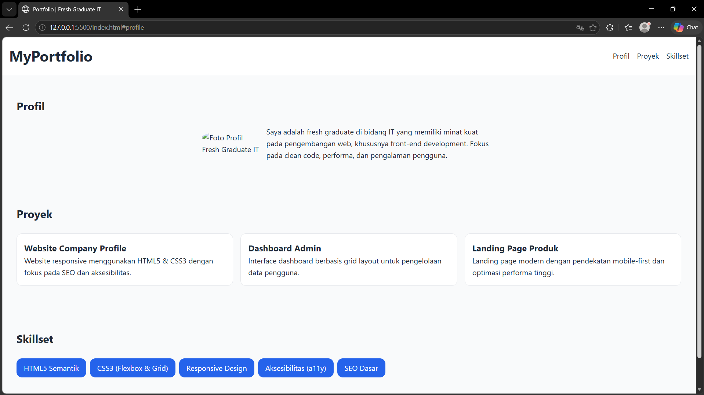
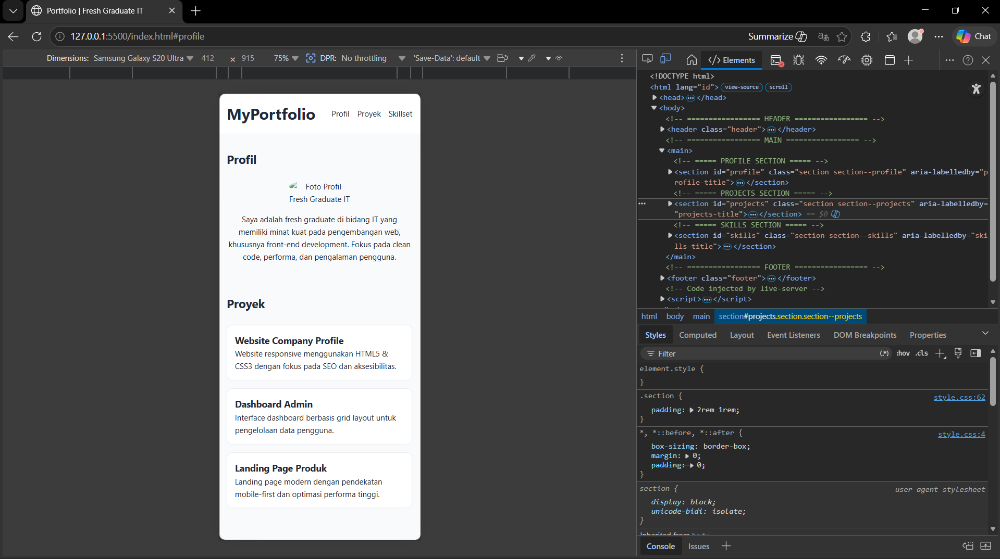

# Final Results — [Nama]

## Portfolio Info
- **Nama: Agri Ergianto Prasetya** 
- **Repository:** [GitHub URL]
- **Live URL:** [GitHub Pages URL]
- **Date: 5/5/2026** 

---

## Screenshot: Desktop

---

## Screenshot: Mobile

---

## What I Learned

1. Saya belajar bahwa prompt yang spesifik menghasilkan kode yang lebih minim error dan dapat dipahami alurnya

2. Saya lebih memahami penggunaan tag <header>, <main>, dan <section> untuk aksesibilitas, serta cara membuat layout responsif dengan Flexbox

3. AI membantu saya mencari solusi cepat untuk bug CSS, namun saya tetap harus memvalidasi kode tersebut agar sesuai standar

---

## Challenges & Solutions
Challange 1 : Awalnya saya terlalu banyak menggunakan tag 
 (div-soup) untuk semua bagian, sehingga struktur kode sulit dibaca oleh screen reader dan tidak optimal secara SEO.
How I Solved : Saya melakukan refaktorisasi kode dengan mengganti 
 umum menggunakan elemen HTML Semantik. Bagian atas saya ganti menjadi <header>, konten utama menjadi <main>, navigasi menjadi <nav>, dan tiap bagian proyek menggunakan <section>. Ini membuat struktur dokumen lebih logis dan profesional.

Challange 2 : Saya sulit untuk menjaga konsistensi warna dan jarak (spacing) di seluruh halaman. Setiap kali ada perubahan warna tema, saya harus menggantinya satu per satu di ribuan baris CSS, yang sangat rawan kesalahan.
How I Solved : Saya mengimplementasikan CSS Variables (--primary-color, --main-spacing, dll.) di dalam selector :root. Dengan cara ini, saya cukup mengubah nilai di satu tempat saja, dan seluruh tampilan web akan terupdate secara otomatis secara konsisten.